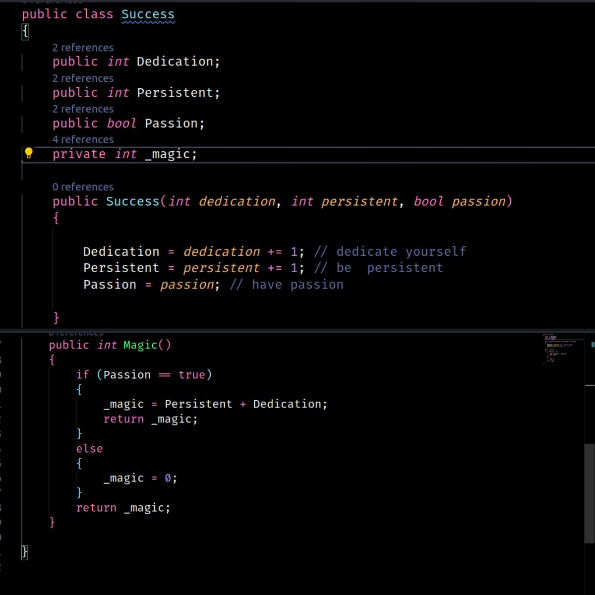

# Olá, seja bem vindo

## Sobre Mim 
Nasci em Campo Grande/MS onde moro atualmente. Sou apaixonado por animes, gravar vídeos com animações, jogar clash royale, passear com minha família e amigos. Me tornei chefe de cozinha devido as dinâmicas e criatividades para fazer as comidas, e, por conta desse meu lado criativo, necessário para desenvolver aplicações web e para celular, me apaixonei por tecnologia. Hoje eu estudo Desenvolvimento Web Full Stack na Trybe e sonho em evoluir profissionalmente como um desenvolvedor, pois trabalhar com algo que se ama e sente prazer é uma realização incrível.

## Pontos importantes

- :fire: Almejo me tornar um Desenvolvedor Back-end de alta performance
- :muscle: Estou aberto para novos desafios. #AVANTE </li>
- :smiley: Pode me chamar de yan ou yang mas, gosto muito quando falam a pronuncia do meu nome,<strong>yan uan<strong></li>

## Tecnologias e Ferramentas 

   

<a target="_blank" rel="noopener noreferrer" href="https://camo.githubusercontent.com/b3ce9472d369cacc72c37b7be98298b051836c138eada89587178fbd41939043/68747470733a2f2f63646e2e6a7364656c6976722e6e65742f67682f64657669636f6e732f64657669636f6e2f69636f6e732f637373332f637373332d706c61696e2d776f72646d61726b2e737667">

  
  
   
   
   # Motivação em c#
   
 
 

## Redes sociais

## Git Hub Stats

<h2><a href="https://yangwom.github.io/portfolio-react.js/#/">Meu portfólio</a></h2>

